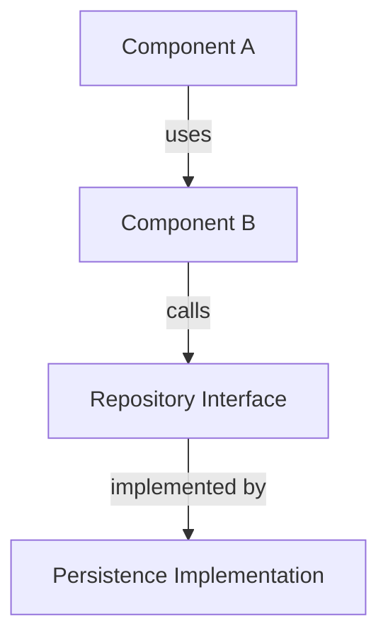

# Design — Architecture & Component Decisions

Document architectural decisions before task breakdown. Skipped for straightforward changes.

## When to Use

**Use DESIGN when:**
- New bounded contexts are introduced
- New patterns or abstractions are being established
- Multiple bounded contexts interact in non-trivial ways
- New external integrations or infrastructure components are needed
- The implementation approach has significant trade-offs that affect future work

**Skip DESIGN when:**
- Change is additive within an existing pattern (new field, new use case following established structure)
- All architectural decisions are already documented in `.specforge/architecture/`
- The spec is Medium complexity with a clear, obvious path

## Pre-Work

1. Load `spec.md` for the feature (always)
2. Load `context.md` if it exists (user decisions from discuss phase)
3. Load `.specforge/architecture/` — every decision must align with these guides
4. Load `.specforge/STATE.md` — check for relevant past decisions (AD-NNN entries)

## Knowledge Verification

Before any architectural decision, follow this chain in order:

1. **Existing codebase** — check if the pattern already exists; reuse first
2. **`.specforge/architecture/`** — validate against established guides
3. **Project docs** — README, inline docs, existing interfaces
4. **Web search / official docs** — only for unfamiliar libraries or new integrations
5. **Flag as uncertain** — if steps 1-4 don't give a clear answer, say so explicitly

Never fabricate. "I'm not certain about X — here's my reasoning, but verify" is always better than a wrong answer that cascades through PLAN and EXECUTE.

## Design Document Sections

Save to: `{artifacts.path}/specs/{feature-slug}/design.md`

---

### Component Overview

High-level diagram (mermaid) showing the components and their relationships.



### Components

For each new or significantly changed component:

```markdown
#### {ComponentName}

**Type:** Aggregate | Entity | Value Object | Use Case | Repository | Service
**Bounded Context:** {context}
**Responsibility:** {single, clear responsibility}

**Interface/Protocol:**
```
{ComponentName}:
  - method(param: type) → result | error
```
Use the notation from the project's language (`.specforge/architecture/conventions`).

**Reuses:** {existing component it builds on, or "none"}
**Why new vs reuse:** {justification if not reusing}
```

### Data Flow

For features with non-trivial data movement:

```markdown
#### {Flow Name}

1. {Actor} calls {Component.Method} with {input}
2. {Component} validates {invariant}
3. {Component} calls {Repository.Method}
4. {Result} returned as {type}

**Error paths:**
- {Error condition} → returns {ErrorType}
- {Error condition} → returns {ErrorType}
```

### Architectural Decisions

Document decisions that future maintainers need to understand:

```markdown
#### AD-{NNN}: {Decision title}

**Context:** {What forced this decision}
**Decision:** {What was decided}
**Rationale:** {Why this option over alternatives}
**Trade-offs:** {What you give up}
**Consequences:** {What this enables or constrains going forward}
```

Copy AD entries to `.specforge/STATE.md` after approval.

### Migration & Backwards Compatibility (if applicable)

Document any schema changes, API changes, or data migrations needed.

### Risks

Design-level risks not captured in the spec:

```markdown
| Risk | Mitigation |
|---|---|
| {risk} | {mitigation} |
```

---

## Validation Checklist

- [ ] All new components are justified (no premature abstraction)
- [ ] Existing patterns are reused where possible
- [ ] Every interface aligns with `.specforge/architecture/` guides
- [ ] Layer dependency direction is respected (domain does not depend on infrastructure)
- [ ] Error/exception types are defined per bounded context
- [ ] Data flow covers error paths, not just happy path
- [ ] AD entries are written for non-obvious decisions
- [ ] Migration plan exists if schema or API changes are needed

## After Approval

1. Copy AD entries to `.specforge/STATE.md` (Decisions section)
2. Save `design.md` to artifacts path
3. Proceed to [plan.md](plan.md)
