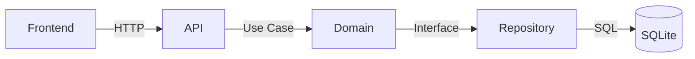

# TDD — Technical Design Document

Comprehensive alignment document for features that require stakeholder sign-off, cross-team coordination, security review, or compliance approval. Produced before implementation begins.

## When to Use

**Use TDD when any of the following apply:**
- Feature involves payments, authentication, or PII (security section becomes mandatory)
- Feature needs sign-off from product, security, or compliance before implementation
- Feature spans multiple teams or external dependencies
- Feature is Large or Complex complexity
- Feature will be in production and needs monitoring/rollback plan documented
- Feature involves schema migrations or data backfills

**Skip TDD when:**
- Feature is Quick or Simple
- Change is internal to one team with no external stakeholders
- No compliance, security, or monitoring considerations

## Pre-Work

1. Load approved `spec.md` — TDD builds on top of the spec, not from scratch
2. Load `.specforge/project.yaml` — for `artifacts.path` and `project.language`
3. Load `.specforge/STATE.md` — check relevant decisions (AD-NNN) and lessons (L-NNN)
4. Load `.specforge/architecture/` — all decisions must align

## Project Size Adaptation

| Size | Signals | Mandatory sections | Optional sections |
|---|---|---|---|
| **Small** (< 1 week) | 1 bounded context, no external deps | 1–7, 9 | — |
| **Medium** (1–4 weeks) | Multi-context, some external deps | 1–11 | 12, 14, 15, 18 |
| **Large** (> 1 month) | Multi-team, compliance, migration | 1–20 | — |

## Interactive Gathering Protocol

Ask the user — **one question at a time** — for information not already in `spec.md`:

1. **Project size**: Small (< 1 week) / Medium (1–4 weeks) / Large (> 1 month)?
2. **Project type** (can be multiple): External integration / New feature / Refactor-migration / Infrastructure / Payment-billing / Auth-security / Data migration?
3. **Stakeholders**: Who needs to review and sign off?
4. For payment/auth/PII: Security requirements (encryption, compliance — LGPD, PCI DSS)?
5. For production systems: What metrics and alerts matter? Rollback triggers?
6. Optional sections the user wants to include?

**Do not ask for information already captured in `spec.md`** — import it directly.

---

## Document Sections

### 1. Header & Metadata (mandatory)

```markdown
# TDD — {Feature Title}

| Campo | Valor |
|---|---|
| Tech Lead | @{name} |
| Time | {members} |
| Issue | [{ISSUE-ID}]({url}) |
| Spec | [{spec path}]({spec path}) |
| Status | Rascunho / Em revisão / Aprovado |
| Criado em | {YYYY-MM-DD} |
| Atualizado em | {YYYY-MM-DD} |
```

---

### 2. Contexto (mandatory)

```markdown
## Contexto

{2–4 parágrafos: estado atual do sistema, domínio de negócio afetado, quem é impactado.
 Importe do spec.md se já estiver documentado.}
```

---

### 3. Problema e Motivação (mandatory)

```markdown
## Problema e Motivação

### Problemas que estamos resolvendo

- **Problema 1**: {descrição com impacto quantificado se possível}
- **Problema 2**: {descrição com impacto}

### Por que agora?

- {driver de negócio, técnico ou de usuário}

### Impacto de não resolver

- **Negócio**: {perda de receita, desvantagem competitiva}
- **Técnico**: {acúmulo de débito técnico, risco de degradação}
- **Usuário**: {experiência degradada, risco de churn}
```

---

### 4. Escopo (mandatory)

```markdown
## Escopo

### ✅ Dentro do escopo (V1)

- {entregável 1}
- {entregável 2}

### ❌ Fora do escopo (V1)

- {feature X — adiada para V2}
- {integração Y — não necessária para MVP}

### 🔮 Considerações futuras (V2+)

- {possível extensão após validação do V1}
```

---

### 5. Solução Técnica (mandatory)

```markdown
## Solução Técnica

### Visão geral da arquitetura

{Descrição de alto nível. Foco em decisões e contratos, não em código de implementação.}

**Componentes principais:**
- {Componente A}: {responsabilidade}
- {Componente B}: {responsabilidade}

**Diagrama de arquitetura:**



### Fluxo de dados

1. {Ação do usuário} → {componente}
2. {Validação} → {componente}
3. {Persistência} → {repositório}
4. {Resposta} → {cliente}

### Contratos de API

| Endpoint | Método | Descrição | Request | Response |
|---|---|---|---|---|
| `/api/v1/{resource}` | POST | {ação} | `{RequestType}` | `{ResponseType}` |

```json
// Exemplo de request/response
POST /api/v1/{resource}
{ "field": "value" }

// 201 Created
{ "id": "...", "field": "value", "createdAt": "..." }
```

### Mudanças no banco de dados

- Nova tabela `{nome}`: {campos principais, índices}
- Migração: {estratégia — quando rodar, rollback disponível}
```

**Princípio crítico:** TDDs documentam **decisões e contratos**, não código de implementação.
- ✅ Incluir: schemas de API, estrutura de tabelas, fluxos, diagramas, decisões de tecnologia
- ❌ Evitar: snippets de código TypeScript/Go, comandos CLI, decorators de framework

---

### 6. Riscos (mandatory)

```markdown
## Riscos

| Risco | Impacto | Probabilidade | Mitigação |
|---|---|---|---|
| {risco} | Alto/Médio/Baixo | Alto/Médio/Baixo | {mitigação} |

**Mínimo 3 riscos.** Considere: dependências externas, integridade de dados, performance, segurança, escopo.
```

---

### 7. Plano de Implementação (mandatory)

```markdown
## Plano de Implementação

| Fase | Task | Owner | Estimativa | Status |
|---|---|---|---|---|
| **Fase 1 — {nome}** | {task} | @{dev} | {Xd} | TODO |
| **Fase 2 — {nome}** | {task} | @{dev} | {Xd} | TODO |

**Estimativa total:** {N} dias

**Dependências:** {o que precisa estar pronto antes de cada fase}
```

---

### 8. Considerações de Segurança (mandatory para payments/auth/PII)

```markdown
## Considerações de Segurança

### Autenticação e Autorização

- **Autenticação**: {método — JWT, OAuth, etc.}
- **Autorização**: {modelo — usuário acessa apenas seus próprios dados}

### Proteção de Dados

- **Em repouso**: {criptografia do banco}
- **Em trânsito**: TLS 1.3 para toda comunicação
- **Secrets**: Variáveis de ambiente, nunca no código ou git

### Conformidade

| Regulação | Requisito | Implementação |
|---|---|---|
| LGPD | Proteção de dados pessoais | {como será implementado} |
| PCI DSS | Não armazenar dados de cartão | Usar tokenização do provedor |

### Boas Práticas

- ✅ Validação de input em todos os endpoints
- ✅ Queries parametrizadas (sem interpolação de strings)
- ✅ Rate limiting
- ✅ Logs de auditoria para operações sensíveis
- ✅ Secrets nunca expostos no frontend ou logs
```

---

### 9. Estratégia de Testes (mandatory)

```markdown
## Estratégia de Testes

| Tipo | Escopo | Meta de cobertura | Abordagem |
|---|---|---|---|
| Unitários | Domínio e use cases | > 80% | stdlib testing, sem testify |
| Integração | Repositórios + banco | Caminhos críticos | SQLite in-memory real |
| E2E (HTTP) | Handlers | Happy path + erros | httptest |

### Cenários críticos

- ✅ {Dado input válido, quando {ação}, então {resultado esperado}}
- ✅ {Dado input inválido, quando {ação}, então {erro de domínio esperado}}
- ✅ {Dado usuário não autenticado, quando {ação}, então 401}
- ✅ {Dado usuário tentando acessar dado de outro usuário, então 404 ou 403}

### Gate

```
cd backend && go test ./...
```
```

---

### 10. Monitoramento e Observabilidade (mandatory para produção)

```markdown
## Monitoramento e Observabilidade

### Métricas

| Métrica | Tipo | Threshold de alerta |
|---|---|---|
| Latência API (p95) | Latência | > 500ms por 5min |
| Taxa de erros | Rate | > 1% por 5min |
| {Métrica de negócio} | Counter | {threshold} |

### Logs estruturados

```json
{
  "level": "info",
  "timestamp": "...",
  "message": "{event}",
  "context": {
    "userID": "...",
    "resourceID": "...",
    "duration_ms": 45
  }
}
```

**O que logar:** requests, chamadas externas, erros com contexto, eventos de negócio
**O que NÃO logar:** passwords, tokens, dados de cartão, PII sensível

### Alertas

| Alerta | Severidade | Canal | Ação |
|---|---|---|---|
| Taxa de erro > 5% | P1 | {canal} | Rollback imediato |
| Latência > 2s (p95) | P2 | {canal} | Investigar |
```

---

### 11. Plano de Rollback (mandatory para produção)

```markdown
## Plano de Rollback

### Triggers para rollback

| Gatilho | Ação |
|---|---|
| Taxa de erro > 5% por 5min | Rollback imediato |
| {Falha crítica específica} | Rollback imediato |
| Latência > 3s (p95) por 10min | Investigar; rollback se sem solução rápida |

### Passos

1. {Desabilitar feature flag / reverter deploy}
2. {Executar down migration se houver mudança de schema}
3. {Verificar que o sistema voltou ao estado anterior}
4. {Notificar equipe e registrar incidente}

### Considerações de banco

- Down migration sempre disponível antes do deploy
- Snapshot antes de migrations em produção
- Testar rollback no staging antes do deploy
```

---

### 12. Métricas de Sucesso (sugerida)

```markdown
## Métricas de Sucesso

| Métrica | Baseline | Meta | Como medir |
|---|---|---|---|
| {métrica técnica} | N/A | {valor} | {ferramenta} |
| {métrica de negócio} | {atual} | {target} | {ferramenta} |
```

---

### 13. Glossário (sugerida)

```markdown
## Glossário

| Termo | Definição |
|---|---|
| {Termo} | {O que significa no contexto deste domínio} |
```

---

### 14. Alternativas Consideradas (sugerida)

```markdown
## Alternativas Consideradas

| Opção | Prós | Contras | Por que não escolhida |
|---|---|---|---|
| **{Opção escolhida}** | + {vantagem} | - {desvantagem} | ✅ Escolhida |
| {Alternativa A} | + {vantagem} | - {desvantagem} | {motivo da rejeição} |
```

---

### 15. Dependências (sugerida)

```markdown
## Dependências

| Dependência | Tipo | Owner | Status | Risco |
|---|---|---|---|---|
| {serviço/time} | Externa/Interna | {owner} | Pronto/Pendente | Baixo/Médio/Alto |
```

---

### 16. Questões em Aberto (sugerida)

```markdown
## Questões em Aberto

| # | Questão | Contexto | Owner | Status |
|---|---|---|---|---|
| 1 | {pergunta} | {por que importa} | @{pessoa} | 🔴 Aberta |
```

---

### 17. Plano de Migração (sugerida, se aplicável)

```markdown
## Plano de Migração

| Fase | Descrição | Usuários afetados | Duração | Rollback |
|---|---|---|---|---|
| 1 | {preparação} | 0% | {N dias} | N/A |
| 2 | {piloto} | 5% | {N dias} | < 5min |
| 3 | {rollout completo} | 100% | {N dias} | < 5min |
```

---

### 18. Aprovação e Sign-off (sugerida)

```markdown
## Aprovação

| Papel | Nome | Status | Data | Comentários |
|---|---|---|---|---|
| Tech Lead | @{nome} | ⏳ Pendente | — | — |
| Product | @{nome} | ⏳ Pendente | — | — |
| Segurança | @{nome} | ⏳ Pendente | — | Obrigatório para payments/auth |
```

---

## Checklist de Validação

**Seções obrigatórias:**
- [ ] Header com Tech Lead, time e link do issue
- [ ] Contexto com domínio e stakeholders
- [ ] Problema com impacto quantificado
- [ ] Escopo: in-scope e out-of-scope explícitos
- [ ] Solução técnica com diagrama ou fluxo
- [ ] Mínimo 3 riscos com mitigação
- [ ] Plano de implementação com fases e estimativas

**Se payment/auth/PII:**
- [ ] Seção de segurança presente
- [ ] Conformidade identificada (LGPD, PCI DSS)
- [ ] Secrets management documentado

**Se sistema em produção:**
- [ ] Métricas e alertas definidos
- [ ] Triggers de rollback explícitos
- [ ] Down migration disponível se houver mudança de schema

## Output e Próximos Passos

1. Salve o TDD em: `{artifacts.path}/specs/{feature-slug}/tdd.md`
2. Atualize o issue no tracker com link para o TDD
3. Copie decisões arquiteturais para `.specforge/STATE.md` (seção Decisions)
4. Aguarde aprovação dos stakeholders listados na seção 18
5. Após aprovação → [design.md](design.md) se necessário, ou direto para [plan.md](plan.md)
